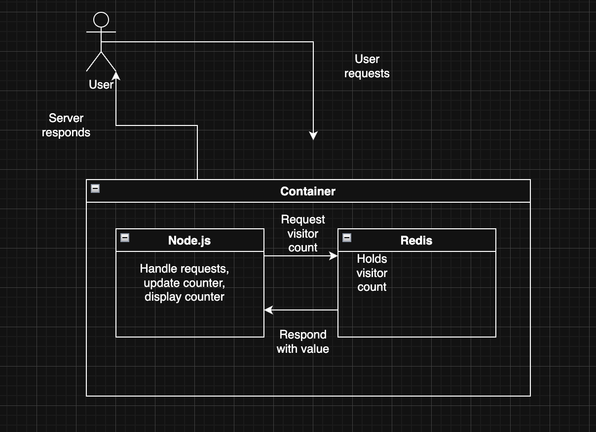

# CSC 468: Introduction to Cloud Computing
## Architecture Overview


## Project Specification
**Based on "Project Overview" lecture requirements**

### Visitor Counter Application
This project implements a distributed web application utilizing a Node.js application server communicating with a Redis in-memory data store to maintain a persistent visitor counter. The system increments and returns the counter value upon each client connection to the web server.

#### Component 1: Node.js Application Server
The application server provides an HTTP endpoint that retrieves the current visitor count from Redis, atomically increments the value, persists the updated count, and returns the result to the client via HTTP response.

#### Component 2: Redis Data Store
A Redis instance serves as the persistence layer, storing the visitor_counter key-value pair. The application server interfaces with Redis to perform atomic read-modify-write operations on the counter value.

## Build Configuration
### Dockerfile Specification
The build process utilizes the node:18-alpine base image to minimize container footprint while providing the required Node.js runtime environment. The build follows Docker best practices by:

1. Copying dependency manifests (package.json, package-lock.json) prior to installing dependencies
2. Executing npm install to install required packages
3. Copying application source code into the container workspace
4. Exposing port 3000 for external HTTP traffic
5. Setting the container entrypoint to execute server.js

This layered approach optimizes Docker's build cache, ensuring dependency installation only occurs when package manifests change.

## Network Architecture
Both containers operate within the csc468cloud Docker bridge network. The Node.js application server exposes port 3000, making it accessible via the CloudLab instance URL. The Redis container remains unexposed to external networks, accepting connections only from the application server over the internal Docker network. This configuration follows the principle of least privilege by restricting database access to authorized application components while maintaining public HTTP endpoint availability.

## File Structure

```
CSC468CLOUD/
├── .github/
├── src/
│   ├── docker/
│   │   ├── containerd/
│   │   ├── docker_config/
│   │   │   ├── daemon.json
│   │   │   ├── docker-compose.yml
│   │   │   └── Dockerfile
│   │   └── install_docker.sh
│   └── server/
│       ├── frontend/
│       │   └── src/
│       │       ├── app.js
│       │       ├── index.html
│       │       └── style.css
│       ├── node_modules/
│       ├── package-lock.json
│       ├── package.json
│       └── server.js
├── diagram.png
├── Full_Resume-3.pdf
├── .gitignore
├── profile.py
└── README.md
```